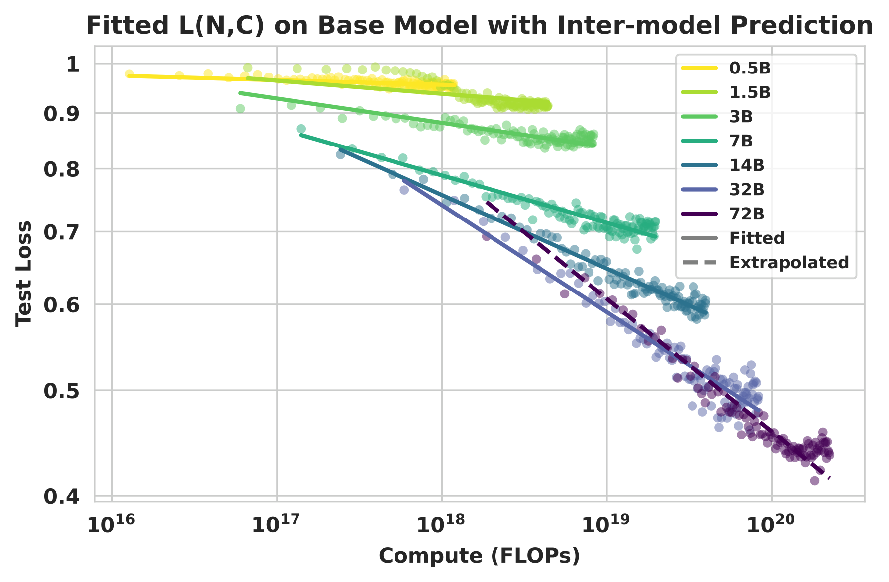
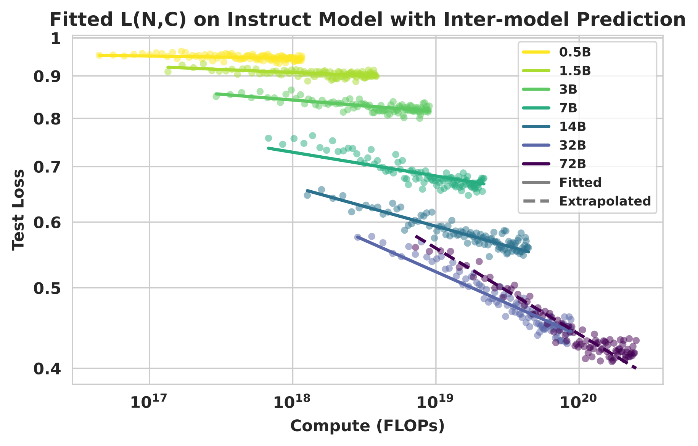
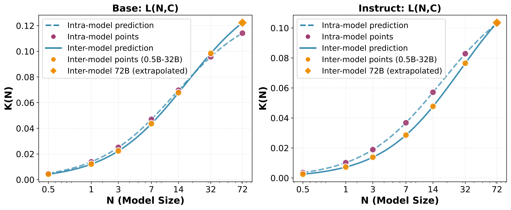
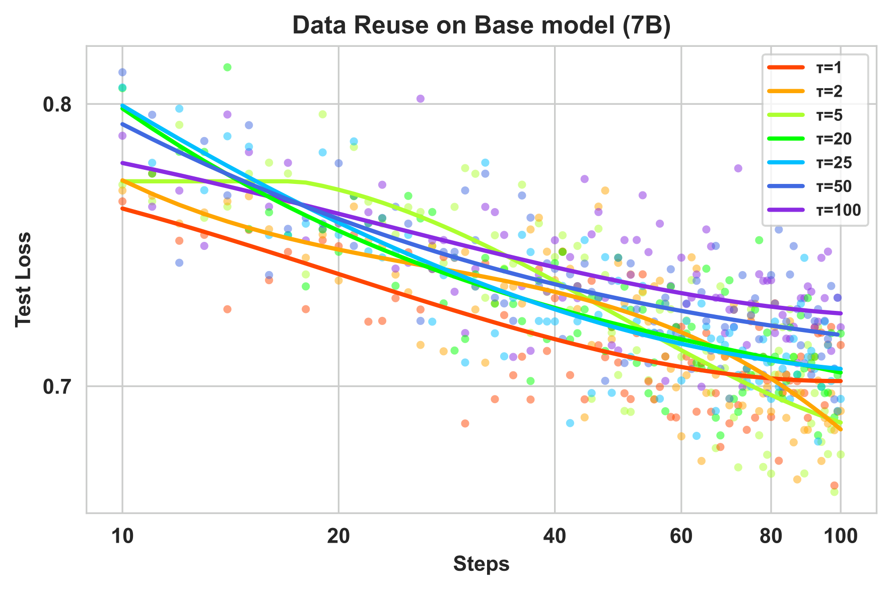
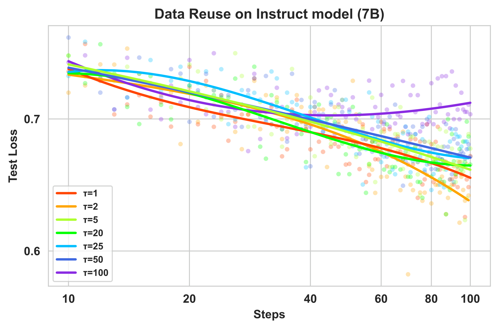

# Scaling Behaviors of LLM Reinforcement Learning Post-Training

[]()
[](LICENSE)
[](https://arxiv.org/abs/2509.25300v2)

**An Empirical Study in Mathematical Reasoning**

This repository contains the implementation and experimental code for our paper: *"Scaling Behaviors of LLM Reinforcement Learning Post-Training: An Empirical Study in Mathematical Reasoning"*.

## 📖 Overview

This research systematically investigates scaling behaviors in RL-based post-training for large language models, with a focus on mathematical reasoning. Through **63 experiments** across the full **Qwen2.5 dense model series (0.5B to 72B)**, we characterize how model scale, data volume, and computational budget interact to shape performance.

### Key Contributions

- 🔬 **Comprehensive Scaling Analysis**: First systematic study of RL post-training scaling laws across 0.5B-72B parameters for mathematical reasoning
- 📊 **Predictive Power Laws**: Established robust relationships between model performance, compute, and data
- 🎯 **Learning Efficiency Insights**: Discovered efficiency saturation trends in larger models
- 💾 **Data Reuse Strategy**: Demonstrated effectiveness of data reuse in constrained settings (up to 25× reuse with minimal degradation)

---

## 🎯 Main Findings

**🔑 Finding 1: Predictive Scaling Laws**

The relationship between test loss `L` (where `L = 1 - Pass@1`) and training resource `X` (Either compute `C` or Data `D`) follows robust power-law patterns:

$$
\log L(N, X) = -k(N) \cdot \log X + E(N)
$$
where
$$
k(N) = \frac{K_{\mathrm{max}}}{1 + \frac{N_0}{N}}
$$

It enables accurate **PREDICTIONS** for both unseen model sizes and remaining training trajectories.

<p align="center">
  
  
</p>
<p align="center">
  <b>Inter-model Extrapolation in compute scenario:</b> Fitted on 0.5B-32B, extrapolated to 72B
</p>

<p align="center">
  
  
</p>
<p align="center">
  <b>Intra-model Prediction in compute scenario:</b> Predict remaining trajectory from early steps
</p>

**🔑 Finding 2: Learning Efficiency Saturation**

Larger models consistently achieve better learning efficiency during RL post-training. As shown in the figures below, scaling up model size leads to substantial improvements in compute efficiency. But our analysis reveals that the learning efficiency coefficient k(N) exhibits a saturation trend, where the marginal gains in learning efficiency gradually diminish.

<p align="center">
  
</p>
<p align="center">
  <b>Learning Efficiency Saturation:</b> k(N) follows a saturation curve, with diminishing marginal returns as N increases
</p>

This saturation pattern becomes particularly evident beyond 32B parameters, which may introduce a trade-off between model scale and training steps under limited compute budgets.

**🔑 Finding 3: Data Reuse Effectiveness**

In data-constrained settings, repeated reuse of high-quality data is effective. Final performance is primarily governed by total optimization steps rather than sample uniqueness.

<p align="center">
  
  
</p>
<p align="center">
  <b>Data Reuse Analysis:</b> Performance remains stable up to τ=25 reuses (Base & Instruct)
</p>

- Performance stable up to **τ = 25** (25× reuse)
- Moderate overfitting only appears at extreme reuse factors (τ = 100)

---

## 🚀 Quick Start

### 1. Environment Setup

```bash
# System Requirements
# - Python 3.12
# - CUDA 12.4
# - PyTorch 2.6.0

# Clone repository
git clone https://github.com/tanzelin430/Mathematical-Reasoning-RL-Scaling-Law.git
cd Agentic-RL-Scaling-Law

# Install dependencies
pip install -r requirements.txt
pip install -e .[gpu,test,math,vllm]
```

### 2. Data Preparation

```bash
# Download and prepare the guru-RL-92k mathematics dataset
python src/data/prepare_math_by_difficulty_full.py

# The script will:
# - Parse Qwen2.5-7B pass rates
# - Classify problems by difficulty (easy: rate ≥ 0.3, hard: rate < 0.3)
# - Generate curriculum-ordered dataset (53,904 train + 500 test)
```

**Dataset Structure:**
- **Training**: 53,904 math problems (ordered by increasing difficulty)
- **Validation**: 500 held-out math problems (stratified sampling)
- **Evaluation**: Multi-domain benchmarks (AIME, GSM8K, AMC, HumanEval, etc.)

### 3. Run Training

```bash
# Train different model sizes (0.5B to 72B)
bash scripts/train/run_grpo_qwen2.5_0.5b_math_full_cl.sh   # 0.5B
bash scripts/train/run_grpo_qwen2.5_1.5b_math_full_cl.sh   # 1.5B
bash scripts/train/run_grpo_qwen2.5_3B_math_full_cl.sh     # 3B
bash scripts/train/run_grpo_qwen2.5_7b_math_full_cl.sh     # 7B
bash scripts/train/run_grpo_qwen2.5_14B_math_full_cl.sh    # 14B
bash scripts/train/run_grpo_qwen2.5_32B_math_full_cl.sh    # 32B
bash scripts/train/run_grpo_qwen2.5_72B_math_full_cl.sh    # 72B
```

**Training Configuration:**
- **Algorithm**: GRPO (Group Relative Policy Optimization)
- **Batch Size**: 512
- **Rollout**: 8 responses per prompt
- **Learning Rate**: 1e-6
- **KL Coefficient**: 0.001
- **Max Sequence Length**: 2048 (input) + 4096 (output)
- **Framework**: VeRL with FSDP distributed training


## 📊 Experimental Setup

### Models
- **Architecture**: Qwen2.5 series (shared architecture across all sizes)
- **Sizes**: 0.5B, 1.5B, 3B, 7B, 14B, 32B, 72B parameters
- **Variants**: Both Base and Instruct models

### Training Data
- **Source**: guru-RL-92k mathematics subset (54.4k problems)
- **Curriculum Learning**: Problems sorted by Qwen2.5-7B pass rate (easy → hard)
- **Train/Test Split**: 53,904 / 500 (stratified by difficulty)

### Evaluation Benchmarks

| Domain | Benchmarks | 
|--------|-----------|
| Math | AIME2024, AMC2023, GSM8K, MATH-500, Held-out data |
| Code | HumanEval | 
| Logic | Zebra Puzzle | 
| STEM | SuperGPQA |


---

## 📂 Repository Structure

```
Agentic-RL-Scaling-Law/
├── verl/                          # VeRL RL training framework
│   ├── trainer/                   # PPO/GRPO training logic
│   ├── workers/                   # FSDP distributed workers
│   └── utils/                     # Reward scoring, datasets
├── scripts/
│   ├── train/                     # Training scripts for different sizes
│   │   ├── run_grpo_qwen2.5_0.5b_math_full_cl.sh
│   │   ├── run_grpo_qwen2.5_7b_math_full_cl.sh
│   │   └── ...
│   └── train_data_check/          # Data validation scripts
├── src/
│   ├── data/                      # Data preprocessing utilities
│   │   ├── pre_verl.py            # Convert to VeRL format
│   │   └── prepare_math_by_difficulty_full.py
│   └── plot/                      # Visualization scripts
├── analysis/                      # Scaling law fitting and analysis code
├── data/                          # Datasets
│   ├── math_curriculum/           # Difficulty-ordered math
│   └── guru_verl/online_eval/     # Multi-domain validation
├── outputs/                       # Generated figures and results
└── SandboxFusion/                 # Code execution sandbox
```

> 💡 **For detailed information on how we analyze the scaling laws and generate the figures in this paper, please refer to the [`analysis/`](analysis/) folder.**

---

## 📝 Citation

If you find this work helpful, please consider citing:

```bibtex
@misc{tan2025scalingbehaviorsllmreinforcement,
      title={Scaling Behaviors of LLM Reinforcement Learning Post-Training: An Empirical Study in Mathematical Reasoning}, 
      author={Zelin Tan and Hejia Geng and Mulei Zhang and Xiaohang Yu and Guancheng Wan and Yifan Zhou and Qiang He and Xiangyuan Xue and Heng Zhou and Yutao Fan and Zhongzhi Li and Zaibin Zhang and Guibin Zhang and Chen Zhang and Zhenfei Yin and Lei Bai},
      year={2025},
      eprint={2509.25300},
      archivePrefix={arXiv},
      primaryClass={cs.LG},
      url={https://arxiv.org/abs/2509.25300}, 
}
```

---

## 🙏 Acknowledgments

- **VeRL Framework** from [Verl](https://github.com/volcengine/verl)
- **Guru-RL-92k Dataset** from [LLM360](https://huggingface.co/datasets/LLM360/guru-RL-92k)
- **Qwen2.5 Models** from [Qwen](https://huggingface.co/Qwen)

---

## 📧 Contact

For questions or collaborations, please contact:
- **Chen Zhang**: zhangchenzc@mail.ustc.edu.cn
- **Zhenfei Yin**: jeremyyin@robots.ox.ac.uk
- **Zelin Tan**: tanzl@mail.ustc.edu.cn

